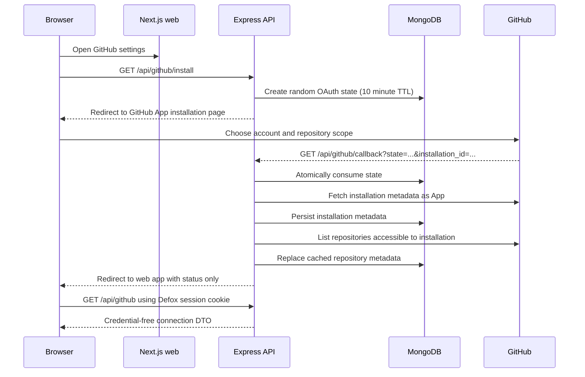
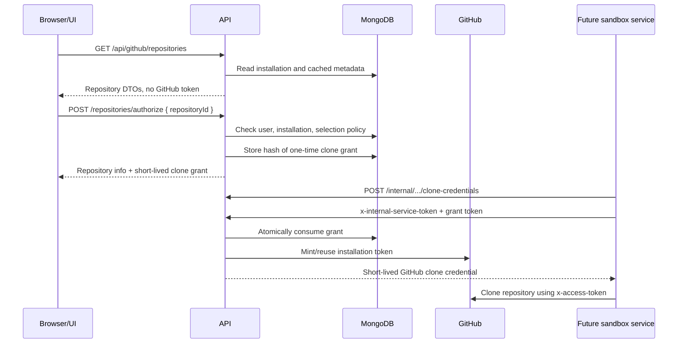

# GitHub Integration Architecture

This document describes how Defox connects to GitHub, how repository access is
authorized, where credentials live, and which components are allowed to use
them.

## Executive Summary

Defox uses a **GitHub App**, not a long-lived personal access token stored in
the browser.

The important security boundary is:

```text
Browser
  -> HTTP-only Defox session cookie
  -> Defox API
       -> GitHub App credentials and short-lived GitHub installation tokens
       -> MongoDB metadata and one-time grant hashes
       -> future sandbox/agent service for repository cloning
```

The browser receives GitHub account and repository metadata only. It does not
receive the GitHub App private key, client secret, OAuth user token, or GitHub
installation access token.

There is one separate token-like value in the browser flow: the
`cloneGrant.token` returned by `POST /api/github/repositories/authorize`. This
is a short-lived, single-use Defox capability, not a GitHub token. It is
intended to be handed to the future internal sandbox service, which redeems it
with the backend. The current UI calls this endpoint, so this distinction
should remain clear in any future frontend work.

## Components

### Web application

Location: `apps/web`

The Next.js application displays connection state and repository metadata. It
starts installation by navigating the browser to `/api/github/install`, reads
connection/repository data, and submits repository-selection changes.

The web application does not contain GitHub secrets. Its shared DTOs are
deliberately credential-free in `packages/shared/src/github.ts`.

### API application

Location: `apps/api`

The Express API owns:

- GitHub App authentication.
- OAuth/install state creation and validation.
- GitHub API calls through Octokit.
- Installation-token caching.
- Repository synchronization and access policy.
- One-time clone-grant creation and redemption.
- Webhook signature verification and installation lifecycle updates.

### MongoDB

MongoDB stores application state and safe GitHub metadata. It does not store a
GitHub access token.

### GitHub

GitHub hosts the App installation/permission screen, provides installation
and repository APIs, redirects the browser to the callback, and sends signed
webhook deliveries.

## Credential Inventory

| Credential                | Created by            | Stored in                                                       | Sent to browser?                | Purpose                                                                          |
| ------------------------- | --------------------- | --------------------------------------------------------------- | ------------------------------- | -------------------------------------------------------------------------------- |
| Defox session JWT         | API login             | HTTP-only cookie in the browser                                 | Yes, as a cookie                | Identifies the Defox user on API requests                                        |
| `GITHUB_PRIVATE_KEY`      | GitHub App setup      | API process environment/secret manager                          | No                              | Signs App JWTs and authenticates App operations                                  |
| `GITHUB_CLIENT_SECRET`    | GitHub App setup      | API process environment/secret manager                          | No                              | OAuth code exchange when GitHub supplies an OAuth code                           |
| GitHub OAuth user token   | GitHub OAuth exchange | API memory inside a local Octokit instance                      | No                              | One-time validation that the authorizing GitHub user can access the installation |
| GitHub installation token | GitHub App auth       | API process memory cache                                        | No                              | Calls GitHub as a specific App installation; also used for cloning               |
| `INTERNAL_SERVICE_TOKEN`  | Defox deployment      | API and future sandbox service environment                      | No                              | Authenticates the internal clone-credentials endpoint                            |
| OAuth `state`             | API                   | MongoDB, short-lived and consumed once                          | Travels through GitHub callback | Binds the GitHub callback to the Defox user who started it                       |
| `cloneGrant.token`        | API                   | Plain value briefly returned to caller; SHA-256 hash in MongoDB | Yes from authorize response     | One-time Defox capability redeemed by the internal service                       |

### Where is the GitHub token stored?

The GitHub installation token is stored only in the API process memory:

- `apps/api/src/modules/github/github.service.ts` has an in-memory
  `Map<number, InstallationToken>` keyed by installation ID.
- The token is cached only while it is fresh.
- GitHub installation tokens are expected to live for one hour.
- Defox refreshes them two minutes before expiry.
- A 401/404 response or installation lifecycle change invalidates the cache.
- Restarting an API process drops the cache and all cached GitHub tokens.
- The token is never written to MongoDB, returned in a normal frontend DTO, or
  logged. Logs include the installation ID and expiry time only.

This means a multi-instance deployment has a separate token cache per API
instance. That is acceptable because tokens can be reminted, but it increases
GitHub auth calls compared with a shared cache.

The GitHub App private key and client secret are not in the repository. They
are loaded from the API process environment by `apps/api/src/config/env.ts`.
`GITHUB_PRIVATE_KEY` supports a PEM value with escaped newlines or a base64
encoded PEM value.

## End-to-End Installation Flow



### 1. Start installation

The user clicks Connect GitHub in
`apps/web/src/components/github-settings.tsx`. The browser navigates to:

```text
/api/github/install?redirect=/settings/github
```

`GET /api/github/install` is protected by `requireAuth`. The API obtains the
authenticated Defox user from the HTTP-only session cookie, generates 32 random
bytes as a hex state value, and stores it in `GitHubOAuthState` with a ten
minute expiry and the desired post-install redirect.

The API then redirects to:

```text
https://github.com/apps/<GITHUB_APP_SLUG>/installations/new?state=<state>
```

The state identifies the Defox user indirectly through MongoDB. It does not
contain the user ID in the URL.

### 2. User chooses GitHub scope

GitHub shows the App installation page. The user chooses a GitHub account or
organization and either all repositories or selected repositories. GitHub owns
this first permission boundary.

The App permissions represented in
`apps/api/src/modules/github/github.constants.ts` are currently:

- Repository metadata: read.
- Repository contents: write.
- Pull requests: write.

Issues, checks, actions, and workflows are listed as future permissions and are
not currently requested by the application-side source of truth.

### 3. Callback validation and installation persistence

GitHub redirects to `GET /api/github/callback`.

The API:

1. Validates the callback query parameters.
2. Atomically finds an unconsumed, unexpired state and marks it consumed.
3. Handles an organization approval request with a `pending` redirect.
4. For a completed installation, requires `installation_id`.
5. Fetches installation metadata using App authentication.
6. If GitHub also returns an OAuth `code`, exchanges it temporarily and checks
   that the authorizing GitHub user can access the returned installation.
7. Rejects an installation already linked to a different Defox user.
8. Upserts the installation record and synchronizes repositories.
9. Redirects the browser with only `github=connected`, `pending`, or an error
   code. No credential is placed in the redirect URL.

The callback does not use the browser session cookie as its only binding. The
single-use state created for the authenticated user is what binds the GitHub
callback to that Defox user.

## Data Stored in MongoDB

### `GitHubOAuthState`

Defined in `apps/api/src/models/github-oauth-state.model.ts`.

Stores:

- Defox `userId`.
- Random state value.
- Redirect path.
- Creation, expiry, and consumption timestamps.

It has a TTL index on `expiresAt`, and callback consumption is an atomic update
requiring `consumedAt: null`. Replaying a callback therefore fails.

### `GitHubInstallation`

Defined in `apps/api/src/models/github-installation.model.ts`.

Stores the relationship between a Defox user and a GitHub App installation:

- GitHub installation ID.
- GitHub account ID, login, type, and optional avatar URL.
- What GitHub granted: `githubRepositorySelection`.
- What the Defox user allows the application to use:
  `repositorySelection`.
- Lifecycle status: `active`, `suspended`, or `removed`.
- Last repository-sync timestamp.

It does **not** contain an access token or private key.

The two repository-selection fields are intentionally separate. GitHub may grant
the App access to all repositories while the Defox user narrows Defox's own
policy to selected repositories.

### `GitHubRepository`

Defined in `apps/api/src/models/github-repository.model.ts`.

Stores cached metadata returned by GitHub:

- Repository and owner IDs/names.
- Visibility and default branch.
- Credential-free HTML and clone URLs.
- GitHub-reported admin/push/pull permissions.
- The Defox-specific `selected` flag.

When a repository is no longer granted by GitHub, synchronization deletes its
local record. The stored `cloneUrl` remains credential-free; credentials are
injected only when the future sandbox clones.

### `GitHubCloneGrant`

Defined in `apps/api/src/models/github-clone-grant.model.ts`.

This is not a GitHub token. It is a Defox capability used to bridge a user
request to the future internal sandbox service. MongoDB stores:

- Defox user ID.
- GitHub repository ID and installation ID.
- SHA-256 hash of the grant token, never the plain token.
- Expiry and consumption timestamps.

The grant expires after five minutes and can be consumed once. Its TTL index
removes expired records.

### `GitHubWebhookEvent`

Defined in `apps/api/src/models/github-webhook-event.model.ts`.

Stores safe delivery metadata only:

- Delivery ID.
- Event and action.
- Installation ID and repository full name when present.
- Whether the event type was handled.
- Receipt timestamps.

The raw webhook body is deliberately not persisted.

## Repository Access Flow



### Synchronization

`GET /api/github/repositories?refresh=true` or
`POST /api/github/repositories/sync` asks GitHub for the repositories currently
accessible to the installation. The API replaces cached metadata, preserves
the Defox `selected` policy, and deletes repositories GitHub no longer grants.

Normal listing reads MongoDB and does not need to mint a GitHub token.

### Authorization gate

The common authorization gate is:

```text
authenticated Defox user
  -> active installation belonging to that user
  -> repository belonging to that installation
  -> repository selected by the Defox policy
```

The API validates every submitted repository ID against the user's installation.
A caller cannot widen access by posting an arbitrary repository ID.

### Creating and redeeming a clone grant

`POST /api/github/repositories/authorize` performs the gate above and creates a
random 32-byte grant. It stores only the SHA-256 hash and returns the plain
grant once with its five-minute expiry.

The internal endpoint is:

```text
POST /api/internal/github/repositories/:githubRepositoryId/clone-credentials
```

It requires `x-internal-service-token` and the one-time grant. The service token
alone is insufficient: the grant determines the user and repository. The API
atomically consumes the grant, checks pull permission again, then obtains the
GitHub installation token and returns clone credentials to the internal
service.

The returned clone credential uses GitHub's expected username
`x-access-token`. It is not returned by the normal browser repository APIs and
the endpoint is intended for service-to-service use only.

## Webhooks

The public endpoint is:

```text
POST /api/github/webhooks
```

It is intentionally unauthenticated by Defox session because GitHub calls it.
Express preserves the raw request bytes for this route. The API verifies
`x-hub-signature-256` using `GITHUB_WEBHOOK_SECRET` before parsing JSON.

Supported event names are recorded, but only installation lifecycle actions
currently change application state:

- `installation.deleted` marks the installation `removed`.
- `installation.suspend` marks it `suspended`.
- `installation.unsuspend` marks it `active`.

Status changes also invalidate the in-memory installation-token cache. Other
supported events are recorded and logged as handled, but their business logic
is still a placeholder.

### Configuration warning

The code comment says the webhook secret is required, but `GITHUB_WEBHOOK_SECRET`
is currently optional in `apps/api/src/config/env.ts`. The webhook handler still
rejects requests without a signature, but a missing configured secret would
make signature verification fail rather than fail fast during API startup. In
production, configure a strong webhook secret and consider making that env
variable required in the schema.

## Browser and Session Behavior

The Defox session is a JWT in an HTTP-only cookie. `requireAuth` reads that
cookie, verifies it with `SESSION_SECRET`, and loads the Defox user. GitHub
endpoints use this Defox identity; they do not trust a user ID supplied by the
browser.

The Next.js rewrite in `apps/web/next.config.ts` is intended to proxy `/api/*`
to Express. However, `apps/web/src/lib/github.ts` currently uses a mixture of:

- `axios` calls directly to `http://localhost:4000/api/github/...` with
  `withCredentials: true`.
- `apiFetch` calls to same-origin paths such as
  `/api/github/repositories/authorize`.

Neither path sends a GitHub token to the browser. The direct Axios calls do
make the browser-to-API request cross-origin in local development and rely on
CORS plus cookies, while the proxy path keeps the request same-origin. For a
consistent production security model, GitHub client calls should use the
same-origin proxy path and one cookie strategy.

## Disconnect Behavior

`DELETE /api/github`:

1. Requires the authenticated Defox user.
2. Deletes the user's cached repository metadata.
3. Deletes outstanding clone grants.
4. Deletes the local installation record.
5. Invalidates the in-memory installation-token cache.

This disconnects Defox's local association. The GitHub App installation itself
is managed on GitHub through the installation management URL. A GitHub deletion
or suspension webhook updates the local status when GitHub sends it.

## What Is Safe to Expose to the Frontend?

Safe frontend data includes:

- GitHub account login, type, ID, and avatar URL.
- Installation ID and management URL.
- Repository IDs, names, URLs, visibility, branch, and permission metadata.
- Defox repository-selection state.
- Stable error codes and callback status values.

Never expose:

- `GITHUB_PRIVATE_KEY`.
- `GITHUB_CLIENT_SECRET`.
- `GITHUB_WEBHOOK_SECRET`.
- `INTERNAL_SERVICE_TOKEN`.
- GitHub OAuth user tokens.
- GitHub installation access tokens.
- Clone credentials.

The clone grant is not a GitHub credential, but it is still sensitive. Treat it
like a short-lived bearer capability: do not log it, put it in URLs, persist it
in browser storage, or expose it to code that does not need to pass it to the
internal service.

## Current Security Posture and Follow-up Items

Implemented protections:

- GitHub secrets are API environment values, not frontend values.
- Installation tokens are memory-only and expiry-aware.
- OAuth/install state is random, expiring, and single-use.
- Callback errors return stable codes rather than GitHub response bodies.
- Repository IDs are checked against the authenticated user's installation.
- Clone grants are hashed, short-lived, and single-use.
- Internal clone credentials require a separate service token.
- Webhook signatures are verified over the raw body.
- Installation lifecycle events invalidate cached credentials.

Items worth tightening before production:

1. Make `GITHUB_WEBHOOK_SECRET` required at startup.
2. Standardize the frontend on the same-origin `/api` proxy instead of direct
   localhost Axios URLs.
3. Ensure production logs and tracing never capture request bodies containing
   clone grants or authorization responses.
4. Keep the future sandbox service isolated from the browser and ensure clone
   credentials are removed from its environment/process output after use.
5. Review whether the App really needs `contents: write`; read-only access is
   preferable until commits are required.
6. Add rate limiting and replay/abuse monitoring around authorization and
   internal credential redemption.

## Source Map

| Concern                           | Main implementation                                          |
| --------------------------------- | ------------------------------------------------------------ |
| Routes                            | `apps/api/src/modules/github/github.routes.ts`               |
| Controllers and redirects         | `apps/api/src/modules/github/github.controller.ts`           |
| GitHub App auth and token cache   | `apps/api/src/modules/github/github.service.ts`              |
| Installation and callback state   | `apps/api/src/modules/github/github.installation.service.ts` |
| Repository sync and authorization | `apps/api/src/modules/github/github.repository.service.ts`   |
| Webhook verification              | `apps/api/src/modules/github/github.webhook.service.ts`      |
| GitHub configuration              | `apps/api/src/config/env.ts`                                 |
| Installation persistence          | `apps/api/src/models/github-installation.model.ts`           |
| Repository persistence            | `apps/api/src/models/github-repository.model.ts`             |
| OAuth state persistence           | `apps/api/src/models/github-oauth-state.model.ts`            |
| Clone grant persistence           | `apps/api/src/models/github-clone-grant.model.ts`            |
| Frontend GitHub calls             | `apps/web/src/lib/github.ts`                                 |
| Frontend connection UI            | `apps/web/src/components/github-settings.tsx`                |
| Credential-free shared DTOs       | `packages/shared/src/github.ts`                              |
| Next.js API proxy                 | `apps/web/next.config.ts`                                    |
